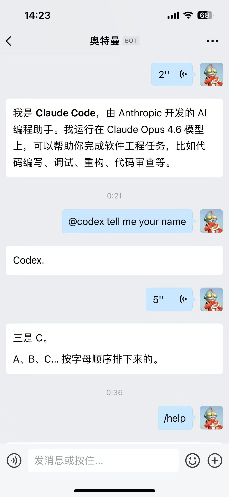

# aibot-connect

企业微信 AI 机器人消息调度框架 —— 连接企业微信智能机器人与 AI Agent，处理消息接收、分发与流式回复。



## 前置条件

- **Node.js >= 20.6.0**
- **企业微信管理后台权限**（能创建智能机器人）

---

## 一、在企业微信创建智能机器人

### 1.1 创建机器人

参考 [企业微信创建智能机器人的两种方式](./docs/企业微信创建智能机器人.md)。

### 1.2 添加到群聊（可选）

在机器人详情页点击「添加到群聊」，可将机器人加入内部工作群，群成员 `@机器人名 消息内容` 即可对话。

---

## 二、安装

```bash
npm install aibot-connect
```

如需使用 Claude Code SDK Agent（可选）：

```bash
npm install @anthropic-ai/claude-agent-sdk
```


## 命令行快速启动（零代码）

全局安装后，无需编写任何脚本即可启动连接：

```bash
npm install -g aibot-connect
```

在项目目录中创建 `.env` 文件配置凭证，然后运行：

```bash
aibot-connect --agent claude                # 使用 Claude Code
aibot-connect --agent codex                 # 使用 Codex
aibot-connect --agent claude --model claude-opus-4-6  # 指定模型
```

也可直接通过命令行传参（优先级高于 .env）：

```bash
aibot-connect --agent codex --bot-id xxx --secret yyy
```

支持的命令：`/reset` `/stop` `/status` `/help`

---

## 三、快速开始（RouterAgent 一行接管）

这是最常用的方式 —— `RouterAgent` 内置路由、命令、会话管理和流式回复，一行 `router.handle(ctx)` 即可接入。

### 3.1 配置环境变量

```ini
# .env
WECOM_BOT_ID=上一步获取的 BotId
WECOM_SECRET=上一步获取的 Secret
```

### 3.2 编写入口文件

```ts
import { createApp, ClaudeCodeCliAgent, RouterAgent } from 'aibot-connect'

// 1. 创建 Agent（选择一种能力源）
const router = new RouterAgent({
  agents: {
    claude: new ClaudeCodeCliAgent({
      cwd: '/your/project',       // Claude Code 工作目录
      model: 'claude-sonnet-4-6', // 模型
    }),
  },
  defaultAgent: 'claude',
  displayName: 'Claude 助手', // 欢迎语中展示的名称
})

// 2. 一行接管消息处理
const app = createApp()
app.onMessage(async (ctx) => {
  await router.handle(ctx)
})

app.onEvent(async (ctx) => {
  await router.handleEvent(ctx)
})

// 3. 启动
await app.start()
process.on('SIGINT', () => app.stop().then(() => process.exit(0)))
```

### 3.3 启动

```bash
npx tsx index.ts
```

启动后，在企业微信中找到你的机器人，发送消息即可获得 AI 回复。同时支持以下内置命令：

| 命令 | 功能 |
|------|------|
| `/reset` | 重置当前会话，开始新对话 |
| `/stop` | 中断正在执行的任务 |
| `/status` | 查看会话状态和用量统计 |
| `/help` | 显示帮助信息 |

---

## 四、示例项目

项目仓库中提供了两个可直接运行的示例，克隆仓库后即可使用：

```bash
git clone https://github.com/xesam/aibot-connect.git
cd aibot-connect
cp .env.example .env  # 编辑 .env，填入你的 BotId 和 Secret
pnpm install
```

### 示例一：框架基础用法

演示 `createApp()` 的完整特性：命令注册、流式回复、中间件审计日志、运行时事件监控。

```bash
pnpm example:basic
```

→ 源码：[examples/basic.ts](examples/basic.ts)

### 示例二：RouterAgent 多 Agent 路由

演示 Claude Code + Codex 双 Agent，通过自定义路由规则 (`@codex 前缀` / 关键词匹配) 自动分配任务。

```bash
pnpm example:router
```

→ 源码：[examples/router-bridge.ts](examples/router-bridge.ts)

---

## 五、`RouterAgent` 详解

`RouterAgent` 是推荐的高层封装：

`router.handle(ctx)` 处理消息：
- 内置命令 `/reset` `/stop` `/status` `/help`
- 多 Agent 路由
- 会话持久化（默认文件存储，重启恢复）
- 流式回复与中断管理

`router.handleEvent(ctx)` 处理事件：
- 入群欢迎语（基于 `displayName` 和已注册的 Agent 列表）

### 多 Agent 路由

可以同时配置多个 Agent，按消息内容自动分发：

```ts
const router = new RouterAgent({
  agents: {
    claude: new ClaudeCodeCliAgent({ cwd: '/project', model: 'claude-opus-4-6' }),
    codex:  new CodexCliAgent({ cwd: '/project' }),
  },
  defaultAgent: 'claude',
  displayName: 'AI 助手',

  // 自定义路由：根据消息内容选择 Agent
  route: async (ctx) => {
    if (ctx.text.includes('审查') || ctx.text.includes('code review')) {
      return 'codex'
    }
    return 'claude'
  },
})
```

### 可用的 Agent

| 类 | 调用方式 | 需要本地环境 |
|---|---------|-------------|
| `ClaudeCodeCliAgent` | `claude` CLI 子进程 | 安装 Claude Code |
| `ClaudeCodeSdkAgent` | `@anthropic-ai/claude-agent-sdk` | 无（纯 SDK 调用） |
| `CodexCliAgent` | `codex` CLI 子进程 | 安装 Codex CLI |

### Agent 配置

```ts
// Claude CLI
new ClaudeCodeCliAgent({
  cwd: string              // 工作目录
  model?: string           // 模型，如 'claude-sonnet-4-6'
  allowedTools?: string[]  // 工具白名单
  maxTurns?: number        // 最大对话轮数
})

// Claude SDK
new ClaudeCodeSdkAgent({
  cwd: string
  model?: string
  allowedTools?: string[]
  maxTurns?: number
  maxBudgetUsd?: number    // 单次会话费用上限
})

// Codex CLI
new CodexCliAgent({
  cwd: string
  model?: string
})
```

### 会话持久化

`RouterAgent` 默认使用 `FileSessionStore`（文件存储到 `data/sessions.json`，30 分钟过期）。可替换：

```ts
import { MemorySessionStore, FileSessionStore } from 'aibot-connect'

// 纯内存（测试用，重启丢失）
new RouterAgent({ agents, defaultAgent: 'claude', sessionStore: new MemorySessionStore() })

// 自定义路径与过期时间
new RouterAgent({
  agents,
  defaultAgent: 'claude',
  sessionStore: new FileSessionStore({
    filePath: '/custom/sessions.json',
    sessionTimeoutMin: 60,
  }),
})
```

---

## 六、`createApp()` 框架用法

如果想更灵活地控制消息处理，可以用 `createApp()` 直接编写 handler。

### 最小示例

```ts
import { createApp } from 'aibot-connect'

const app = createApp()

// 注册命令（优先于 onMessage）
app.onCommand('ping', async (ctx) => {
  await ctx.reply('pong')
})

// 处理事件（如进入会话）
app.onEvent(async (ctx) => {
  await ctx.reply('你好，欢迎进入会话。')
})

// 处理消息
app.onMessage(async (ctx) => {
  await ctx.reply(`你说的是：${ctx.text}`)
})

await app.start()
process.on('SIGINT', () => app.stop().then(() => process.exit(0)))
```

### Context 关键属性

```ts
// ctx.kind —— 消息类型
'message'  // 普通消息
'command'  // 命令消息（/xxx），同时 ctx.command 有值
'event'    // 事件（如进入会话）

// ctx 常用字段
ctx.text             // 消息文本
ctx.msgType          // 'text' | 'image' | 'file' | 'voice'
ctx.chatId           // 会话 ID
ctx.userId           // 用户 ID
ctx.conversationKey  // 会话隔离键（框架内部生成）
ctx.state            // 当前会话共享状态（{ [key]: value }）
ctx.command?.name    // 命令名（仅 command 时）
ctx.command?.args    // 命令参数（仅 command 时）
ctx.channelName      // 消息来源渠道名称（如 'wecom'），由 ChannelAdapter 注入
```

### 两种回复方式

**`reply(text)`** —— 一次性回复：

```ts
await ctx.reply('纯文本回复')
```

**`replyStream()`** —— 流式回复：

```ts
const rs = ctx.replyStream()
rs.append('第一部分...')
rs.append('第二部分...')
await rs.end() // 或 await rs.error('错误信息')
```

> 框架自动处理 19000 字节分片和最终帧发送。

---

## 七、高级自定义

### 调度模式

控制同一会话的并发行为：

```ts
const app = createApp({ dispatchMode: 'serial' })   // 默认：同会话串行
const app = createApp({ dispatchMode: 'parallel' }) // 不加锁，无限制
```

串行模式下可通过 `onBusy` 处理并发冲突：

```ts
const app = createApp({
  dispatchMode: 'serial',
  onBusy: async (ctx) => {
    await ctx.reply('请等待上一条消息处理完毕')
  },
})
```

### 中间件

洋葱模型中间件，覆盖 message/command/event 所有路径：

```ts
app.use(async (ctx, next) => {
  console.log(`[${ctx.traceId}] 开始处理`)
  await next()
  console.log(`[${ctx.traceId}] 处理完成`)
})
```

### 超时与错误处理

```ts
const app = createApp({
  handlerTimeoutMs: 120_000, // 2 分钟超时
  onTimeout: async (ctx) => {
    await ctx.reply('处理超时，请稍后重试')
  },
  onError: async (ctx, error) => {
    console.error('Handler 错误:', error.message)
  },
})
```

### 自定义会话键

默认会话键为 `dm:{userId}`（私聊）或 `group:{chatId}:user:{userId}`（群聊）。可自定义：

```ts
const app = createApp({
  conversationKeyResolver: (ctx) => {
    // 群聊中所有用户共享一个会话
    if (ctx.chatId && ctx.chatId !== ctx.userId) return `shared:${ctx.chatId}`
    return `dm:${ctx.userId}`
  },
})
```

### 可观测事件

通过 `onRuntimeEvent` 监听框架运行时事件，可用于日志、监控、告警：

```ts
const app = createApp({
  onRuntimeEvent: (event) => {
    // event.event 可取：
    // 'message.received' | 'event.received' | 'handler.started'
    // | 'handler.completed' | 'handler.failed' | 'handler.timed_out'
    // | 'busy.rejected' | 'reply.sent'
    // | 'stream.started' | 'stream.updated' | 'stream.ended' | 'stream.failed'
    console.log('[Event]', event.event, event.durationMs)
  },
})
```

### CliAgent 底层用法

如果不使用 `RouterAgent`，可以直接调用 Agent 的流式接口，自行管理会话映射和回复编排：

```ts
import { createApp, ClaudeCodeCliAgent } from 'aibot-connect'

const agent = new ClaudeCodeCliAgent({ cwd: '/project' })
const sessions = new Map() // 自行管理 chatId → sessionId

const app = createApp()
app.onMessage(async (ctx) => {
  const resume = sessions.get(ctx.chatId)
  const stream = agent.query(ctx.text, { resume })
  const rs = ctx.replyStream()
  let started = false

  for await (const msg of stream) {
    switch (msg.type) {
      case 'session':
        sessions.set(ctx.chatId, msg.sessionId)
        break
      case 'text':
        rs.append(msg.text); started = true
        break
      case 'done':
        started ? await rs.end() : await ctx.reply('（无输出）')
        break
      case 'error':
        started ? await rs.error(msg.message) : await ctx.reply(`出错了：${msg.message}`)
        break
    }
  }
})
```

---

## 八、API 参考

### `createApp(options?)`

| 选项 | 类型 | 默认值 | 说明 |
|------|------|--------|------|
| `botId` | `string` | `env.WECOM_BOT_ID` | 企业微信机器人 BotId |
| `secret` | `string` | `env.WECOM_SECRET` | 企业微信机器人 Secret |
| `dispatchMode` | `'serial' \| 'parallel' \| 'custom'` | `'serial'` | 会话并发控制策略 |
| `onBusy` | `'drop' \| ((ctx) => Promise<void>)` | `undefined` | 串行模式下会话忙碌时的处理 |
| `handlerTimeoutMs` | `number` | `undefined` | handler 超时时间（毫秒） |
| `onTimeout` | `(ctx) => Promise<void>` | `undefined` | 超时回调 |
| `onError` | `(ctx, error) => Promise<void>` | `undefined` | 错误回调 |
| `onRuntimeEvent` | `(event) => void` | `undefined` | 运行时事件监听 |
| `conversationKeyResolver` | `(ctx) => string` | 内置规则 | 自定义会话键 |
| `logLevel` | `'debug' \| 'info' \| 'warn' \| 'error' \| 'silent'` | `'info'` | 日志级别 |
| `singleInstance` | `boolean` | `true` | 是否启用 PID 文件锁防止多实例 |
| `adapter` | `ChannelAdapter` | WecomChannelAdapter (default) | 自定义渠道适配器；提供后 `botId`/`secret` 不再必填 |

### `app.onMessage(handler)`

注册消息处理器，handler 接收 `MessageContext`（可使用 `text` / `msgType` / `state` / `reply` / `replyStream`）。已注册的命令（`onCommand`）会优先匹配，不会进入此处理器。

### `app.onEvent(handler)`

注册事件处理器，接收 `EventContext`（仅 `reply()`，无 `replyStream()`）。当前唯一事件是 `enter_chat`（入群欢迎）。

### `app.onCommand(name, handler)`

注册命令处理器，匹配 `/name`（大小写不敏感），优先于 `onMessage`。handler 接收 `MessageContext`。

### `app.use(middleware)`

注册中间件，覆盖所有 message/command/event 路径。

### `app.start()` / `app.stop()`

启动/停止服务。`start()` 获取 PID 锁 → 建立 WebSocket 连接 → 等待 ready。

---

## 九、架构边界

```
IM 渠道 ←→ ChannelAdapter ←→ aibot-connect ←→ onMessage / onCommand / onEvent / middleware
         （默认: WecomChannelAdapter）   │   └─ 流式回复（自动分片 + 终态保护）
                                        │   └─ 会话级并发控制
                                        │   └─ 可观测运行时事件
                                        │
                                        └─ Agent 层（业务自由组合）
                                             ├─ ClaudeCodeCliAgent（CLI 子进程）
                                             ├─ ClaudeCodeSdkAgent（SDK 调用）
                                             ├─ CodexCliAgent（CLI 子进程）
                                             └─ RouterAgent（路由 + 会话 + 回复）
```

- **框架负责**：接收、分发、回复、并发控制与运行时保障
- **Agent 负责**：AI 模型调用与工具执行
- **RouterAgent 负责**：路由策略、会话管理与流式转发
- **你负责**：选择 Agent、配置路由规则、编写业务逻辑

---

## 开发

```bash
pnpm test      # 运行测试
pnpm build     # 编译构建
```

## 致谢

本项目源于 [wecom-claude-bridge](https://github.com/chenrl/wecom-claude-bridge)，感谢原作者的工作。aibot-connect 在其基础之上进行了以下核心重构：

- **架构**：从单体 `Bridge` 类重构为 `createApp()` 工厂 + 中间件管道 + Agent 接口体系
- **Agent 体系**：从仅支持 Claude SDK 扩展为 Claude CLI / Claude SDK / Codex CLI 三种 Agent，通过 `RouterAgent` 统一路由
- **会话管理**：从 JSON 文件直接读写抽象为 `SessionStore` 接口（支持文件 / 内存 / 自定义实现）
- **可观测性**：新增 `RuntimeEvents` 全生命周期事件体系
- **质量保障**：179+ 个测试用例覆盖全部模块，含并发 / 原子写 / 状态机回归

## 许可证

ISC
