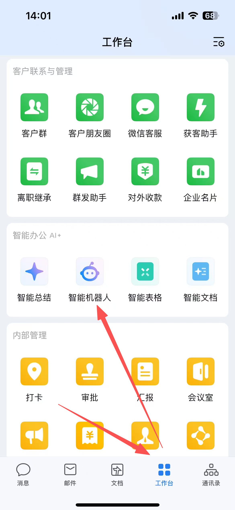
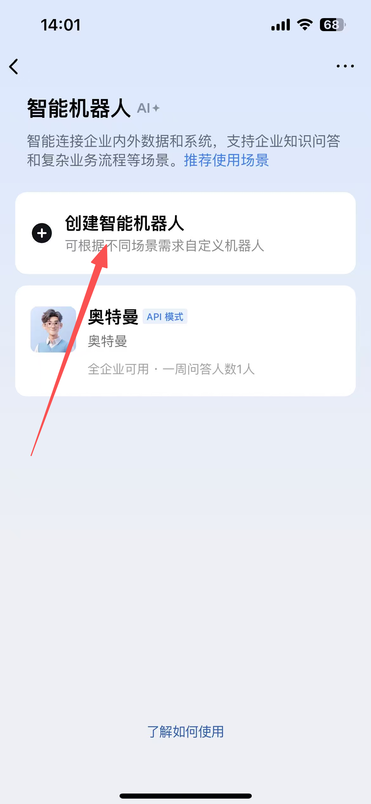
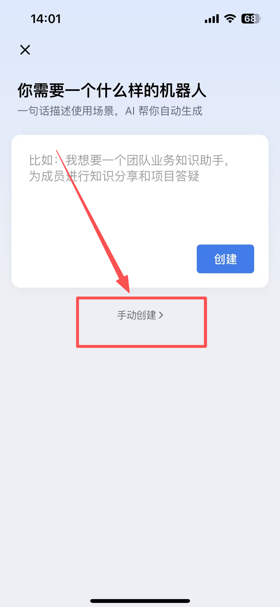
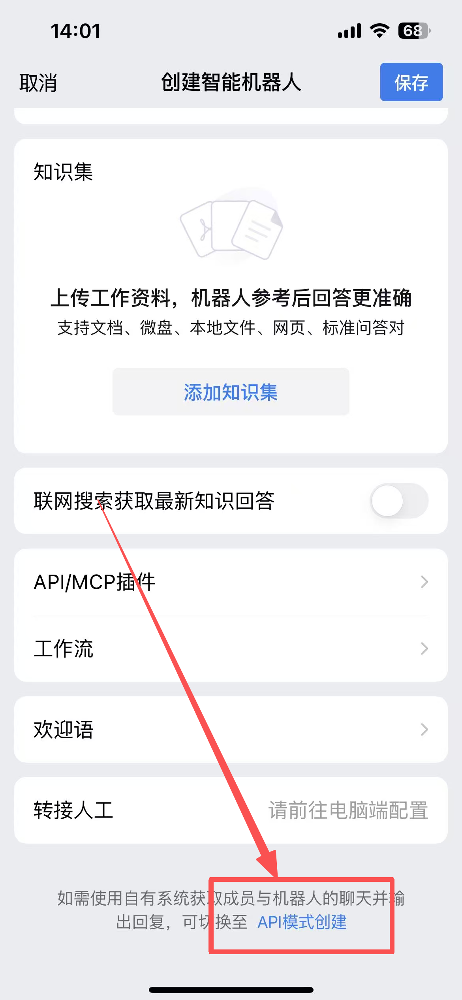
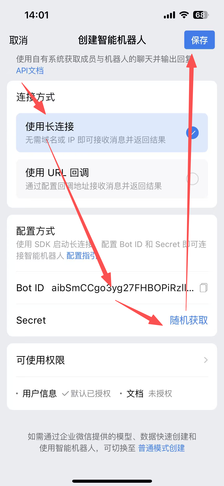

# 企业微信创建智能机器人

本文档包含以下两种方式创建智能机器人的方法：

1. 通过企业微信客户端创建智能机器人
2. 通过企业微信管理后台创建智能机器人

## 1. 通过企业微信客户端创建智能机器人

### 1.1 进入企业微信客户端

### 1.2 点击「创建」按钮

### 1.3 选择“手动创建”

### 1.4 选择“API模式创建”

### 1.5 输入机器人信息，获取凭证

## 2. 通过企业微信管理后台创建智能机器人

### 1.1 进入管理后台

登录 [企业微信管理后台](https://work.weixin.qq.com/wework_admin/frame#apps)，进入「安全与管理」→「管理工具」 →「智能机器人」。

### 2.1 创建机器人

关键点：

1. 选择：手动创建；
2. 选择： **API 模式** ；
3. 选择： **长连接（WebSocket）**

### 2.2 获取凭证

创建完成后，在机器人详情页获取两个关键凭证：

- **BotId** —— 机器人唯一标识
- **Secret** —— 连接密钥

这两个凭证将用于配置环境变量。